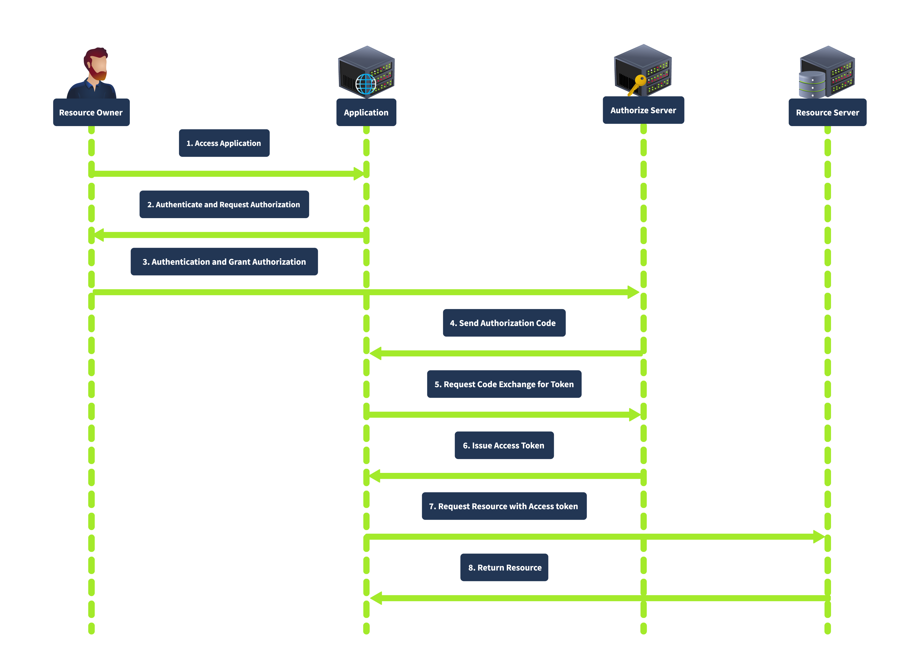
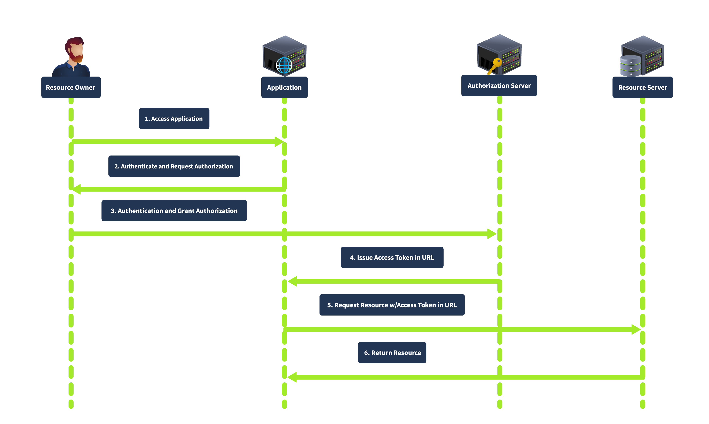
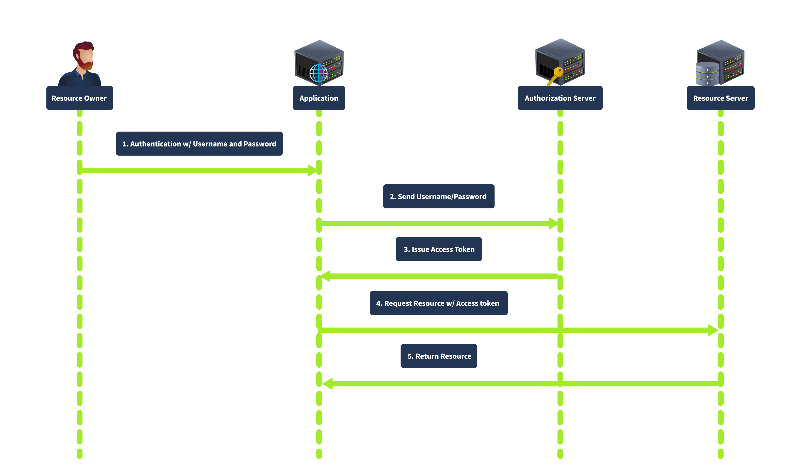
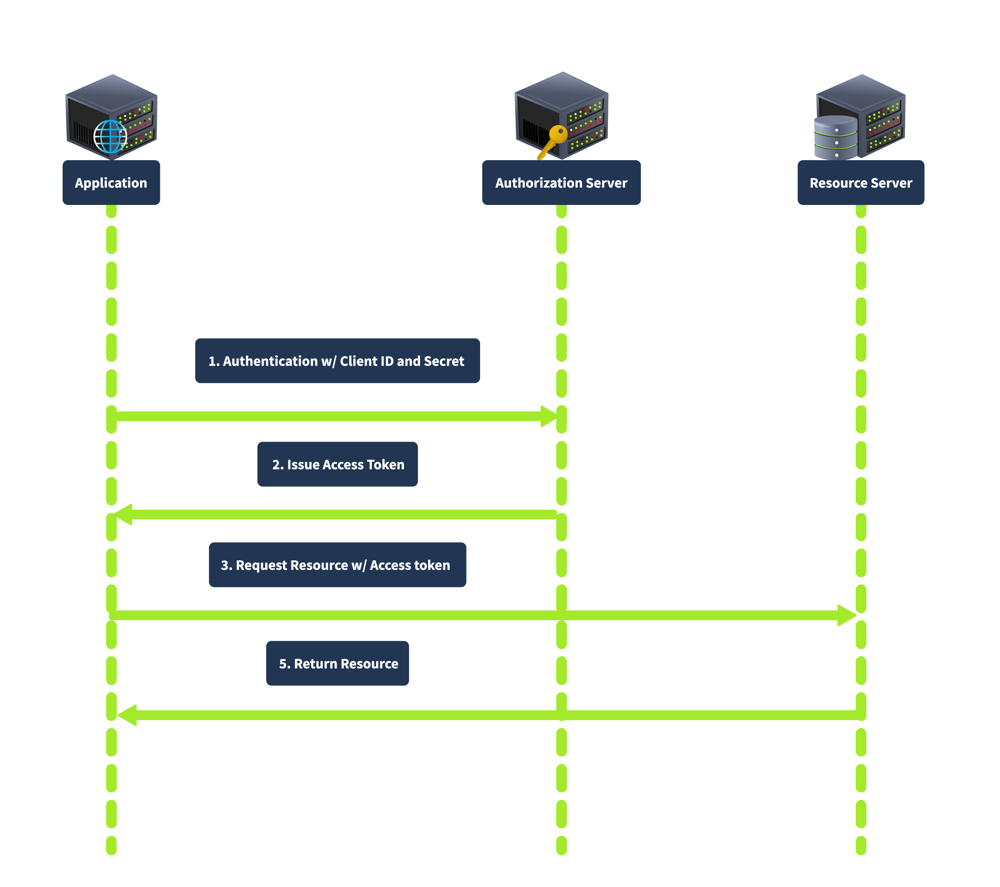

# Các loại cấp quyền OAuth (OAuth Grant Type)
## Authorization Code Grant
Với loại này thì sau khi xác thức và nhận ủy quyền thì Authorize Server sẽ redirect người dùng đến client với Authorization Code

Có thể thấy rằng việc này sẽ làm gia tăng an toàn vì user không đụng vào access token.
## Implicit Grant
Implicit Grant dành cho các client không thể bảo đảm an toàn bí mật. Authorize Server sẽ **gửi thẳng token cho client qua URL**

## Resource Owener Password Credentials Grant
Loại này được sử dụng khi client được tin tưởng rất cao bởi resource owner, chẳng hạn như 1 bên thứ 3. Client sẽ lấy trực tiếp thông tin xác thực của người dùng và dùng nó để trao đổi access token.

## Client Cretential Grant
Được sử dụng cho dạng tương tác server-to-server với ko có sự tương tác của user.

